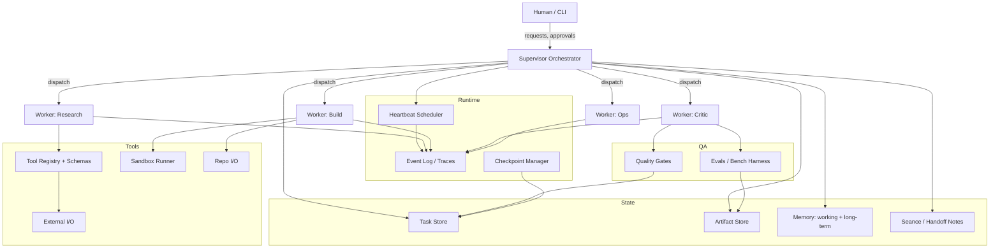

# Agent Development Notes

This is an internal technical note capturing (1) concrete architecture observations from three agent codebases (Gastown, Murmur, Agent of Empires) plus Maggie Appleton's Gastown writeup, (2) a set of SOTA research references and the architectural patterns they contribute, and (3) an abstract reference architecture that unifies the repos and the research into a pragmatic build plan.

All content is ASCII-only.

## Sources

Primary systems:
- Gastown: https://github.com/steveyegge/gastown
  - README: https://raw.githubusercontent.com/steveyegge/gastown/master/README.md
  - Glossary (named components/terms): https://raw.githubusercontent.com/steveyegge/gastown/master/docs/glossary.md
- Murmur: https://github.com/karan-zipline/murmur
  - Raw README: https://raw.githubusercontent.com/karan-zipline/murmur/main/README.md
  - Architecture: https://raw.githubusercontent.com/karan-zipline/murmur/main/docs/ARCHITECTURE.md
  - Orchestration: https://raw.githubusercontent.com/karan-zipline/murmur/main/docs/components/ORCHESTRATION.md
  - Agents: https://raw.githubusercontent.com/karan-zipline/murmur/main/docs/components/AGENTS.md
  - Permissions/questions: https://raw.githubusercontent.com/karan-zipline/murmur/main/docs/components/PERMISSIONS_AND_QUESTIONS.md
  - Worktrees/merge: https://raw.githubusercontent.com/karan-zipline/murmur/main/docs/components/WORKTREES_AND_MERGE.md
- Agent of Empires: https://github.com/njbrake/agent-of-empires
  - Raw README: https://raw.githubusercontent.com/njbrake/agent-of-empires/main/README.md
  - CLI reference: https://raw.githubusercontent.com/njbrake/agent-of-empires/main/docs/cli/reference.md
  - Quick start: https://raw.githubusercontent.com/njbrake/agent-of-empires/main/docs/quick-start.md
  - Worktree quick reference: https://raw.githubusercontent.com/njbrake/agent-of-empires/main/docs/worktree-quick-reference.md
  - Batch issues guide: https://raw.githubusercontent.com/njbrake/agent-of-empires/main/docs/guides/batch-issues.md
  - Sandbox guide: https://raw.githubusercontent.com/njbrake/agent-of-empires/main/docs/guides/sandbox.md
- Maggie Appleton on Gastown: https://maggieappleton.com/gastown

SOTA and adjacent references (see "SOTA References" for per-item contributions and additional citations):
- ReAct: https://arxiv.org/abs/2210.03629
- Reflexion: https://arxiv.org/abs/2303.11366
- Tree of Thoughts: https://arxiv.org/abs/2305.10601
- Graph of Thoughts: https://arxiv.org/abs/2308.09687
- ReWOO: https://arxiv.org/abs/2305.18323
- MemGPT: https://arxiv.org/abs/2310.08560
- Generative Agents: https://arxiv.org/abs/2304.03442
- Voyager: https://arxiv.org/abs/2305.16291
- SWE-bench: https://arxiv.org/abs/2310.06770
- SWE-agent: https://github.com/princeton-nlp/SWE-agent
- AutoGen: https://github.com/microsoft/autogen
- LangGraph: https://github.com/langchain-ai/langgraph
- CrewAI: https://github.com/crewAIInc/crewAI
- AutoGPT: https://github.com/Significant-Gravitas/AutoGPT
- BabyAGI: https://github.com/yoheinakajima/babyagi
- OpenAI tool calling: https://platform.openai.com/docs/guides/function-calling
- Swarm (OpenAI): https://github.com/openai/swarm
- OpenAI Evals: https://github.com/openai/evals
- Guardrails: https://github.com/guardrails-ai/guardrails
- Anthropic effective agents: https://www.anthropic.com/research/building-effective-agents

## Architecture Findings: Gastown

Sources:
- README: https://raw.githubusercontent.com/steveyegge/gastown/master/README.md
- Glossary: https://raw.githubusercontent.com/steveyegge/gastown/master/docs/glossary.md

### Goal

- Provide a multi-agent workspace manager for Claude Code with persistent work tracking, where work state is tracked outside the model context window and survives restarts via git-backed Hooks + Beads.
  - README: https://raw.githubusercontent.com/steveyegge/gastown/master/README.md

### Core components

- Mayor: the primary coordinator agent with town-wide visibility; creates/operates Convoys and slings work to agents.
  - README: https://raw.githubusercontent.com/steveyegge/gastown/master/README.md
  - Glossary: https://raw.githubusercontent.com/steveyegge/gastown/master/docs/glossary.md
- Crew: long-lived, named collaborators (humans + persistent agents) operating inside a Rig.
  - README: https://raw.githubusercontent.com/steveyegge/gastown/master/README.md
  - Glossary: https://raw.githubusercontent.com/steveyegge/gastown/master/docs/glossary.md
- Polecats: ephemeral worker agents spawned for specific work; complete work and disappear.
  - README: https://raw.githubusercontent.com/steveyegge/gastown/master/README.md
  - Glossary: https://raw.githubusercontent.com/steveyegge/gastown/master/docs/glossary.md
- Hook: an agent's git worktree-based persistent queue/state; the key persistence mechanism across crashes/restarts.
  - README: https://raw.githubusercontent.com/steveyegge/gastown/master/README.md
  - Glossary: https://raw.githubusercontent.com/steveyegge/gastown/master/docs/glossary.md
- Convoy: a work-order wrapper that bundles multiple Beads and tracks execution/assignment.
  - README: https://raw.githubusercontent.com/steveyegge/gastown/master/README.md
  - Glossary: https://raw.githubusercontent.com/steveyegge/gastown/master/docs/glossary.md
- Bead: the atomic, git-backed work unit ("issue") stored via Beads; Convoys group Beads.
  - README: https://raw.githubusercontent.com/steveyegge/gastown/master/README.md
  - Glossary: https://raw.githubusercontent.com/steveyegge/gastown/master/docs/glossary.md
- Formula / Protomolecule / Molecule: repeatable workflow templates (Formula), template classes (Protomolecule), and durable chained Bead workflows (Molecule).
  - README (formula workflow example): https://raw.githubusercontent.com/steveyegge/gastown/master/README.md
  - Glossary (definitions): https://raw.githubusercontent.com/steveyegge/gastown/master/docs/glossary.md

### Task representation

- Beads are the durable task/issue objects; Convoys aggregate Beads for coordination.
  - README (Beads integration and Convoys): https://raw.githubusercontent.com/steveyegge/gastown/master/README.md
  - Glossary (Bead, Convoy): https://raw.githubusercontent.com/steveyegge/gastown/master/docs/glossary.md
- Hooks are the persistence substrate for agent-in-progress state (git worktree-based storage).
  - README (Hooks): https://raw.githubusercontent.com/steveyegge/gastown/master/README.md
  - Glossary (Hook): https://raw.githubusercontent.com/steveyegge/gastown/master/docs/glossary.md

### Coordination model

- Hierarchical coordination is expressed as named roles + work routing:
  - Mayor (chief-of-staff coordinator) distributes work via slinging onto Hooks.
    - README (Mayor, sling): https://raw.githubusercontent.com/steveyegge/gastown/master/README.md
    - Glossary (Mayor, Hook, slinging): https://raw.githubusercontent.com/steveyegge/gastown/master/docs/glossary.md
  - Deacon (daemon beacon) runs continuous Patrol cycles as a watchdog/heartbeat, assisted by Dogs; Boot (the Dog) checks the Deacon periodically.
    - Glossary (Deacon, Dogs, Boot, Patrol): https://raw.githubusercontent.com/steveyegge/gastown/master/docs/glossary.md
  - Witness performs Patrol/oversight at the Rig level (monitoring Polecats and merge/integration workflow).
    - Glossary (Witness, Patrol, Polecat): https://raw.githubusercontent.com/steveyegge/gastown/master/docs/glossary.md

### Persistence

- Work state persists in Beads and git-backed Hooks (worktrees), not only in chat context.
  - README (Hooks, Beads integration): https://raw.githubusercontent.com/steveyegge/gastown/master/README.md
  - Glossary (Hook, Bead): https://raw.githubusercontent.com/steveyegge/gastown/master/docs/glossary.md
- Seance + Handoff are explicit session continuity mechanisms (query prior sessions; transfer work state to a fresh session).
  - Glossary (Seance, Handoff): https://raw.githubusercontent.com/steveyegge/gastown/master/docs/glossary.md

### Failure handling and iteration

- GUPP ("if there is work on your Hook, you must run it") is the autonomy/heartbeat principle.
  - Glossary (GUPP): https://raw.githubusercontent.com/steveyegge/gastown/master/docs/glossary.md
- NDI ("nondeterministic idempotence") describes the design goal: reliable outcomes despite stochastic/fragile steps, via persistence + oversight agents.
  - Glossary (NDI): https://raw.githubusercontent.com/steveyegge/gastown/master/docs/glossary.md

## Architecture Findings: Murmur

Sources:
- README: https://raw.githubusercontent.com/karan-zipline/murmur/main/README.md
- Architecture: https://raw.githubusercontent.com/karan-zipline/murmur/main/docs/ARCHITECTURE.md
- Orchestration: https://raw.githubusercontent.com/karan-zipline/murmur/main/docs/components/ORCHESTRATION.md
- Agents: https://raw.githubusercontent.com/karan-zipline/murmur/main/docs/components/AGENTS.md
- Permissions/questions: https://raw.githubusercontent.com/karan-zipline/murmur/main/docs/components/PERMISSIONS_AND_QUESTIONS.md
- Worktrees/merge: https://raw.githubusercontent.com/karan-zipline/murmur/main/docs/components/WORKTREES_AND_MERGE.md

### Goal

- Provide a local-only daemon control plane that supervises multiple agent subprocesses across projects, with unix-socket IPC, per-project orchestration ticks, pluggable issue backends, and a serialized merge pipeline.
  - Architecture: https://raw.githubusercontent.com/karan-zipline/murmur/main/docs/ARCHITECTURE.md
  - README: https://raw.githubusercontent.com/karan-zipline/murmur/main/README.md

### Core components

- Daemon control plane + shared state (project registry, claim registry, pending permissions), with CLI/TUI control via unix domain socket IPC.
  - Architecture (process topology + daemon responsibilities + unix socket IPC): https://raw.githubusercontent.com/karan-zipline/murmur/main/docs/ARCHITECTURE.md
- Per-project orchestrator tick loop that polls "ready" issues and spawns agents up to `max-agents`.
  - Architecture (orchestrator flow + tick): https://raw.githubusercontent.com/karan-zipline/murmur/main/docs/ARCHITECTURE.md
  - Orchestration (core tick + spawn policy): https://raw.githubusercontent.com/karan-zipline/murmur/main/docs/components/ORCHESTRATION.md
- Issue backends: `tk` (local tickets), GitHub, Linear.
  - Architecture (issue backend interface + implementations): https://raw.githubusercontent.com/karan-zipline/murmur/main/docs/ARCHITECTURE.md
- Agent types: coding / planner / manager, each isolated in a git worktree.
  - Agents (agent roles + worktrees): https://raw.githubusercontent.com/karan-zipline/murmur/main/docs/components/AGENTS.md

### Task representation

- Primary "task objects" are issues from the configured backend (IDs + backend state). Orchestration operates on ready issue IDs, a claim registry, and agent records.
  - Orchestration (inputs/outputs are issue IDs + claims): https://raw.githubusercontent.com/karan-zipline/murmur/main/docs/components/ORCHESTRATION.md
  - Architecture (issue backend model): https://raw.githubusercontent.com/karan-zipline/murmur/main/docs/ARCHITECTURE.md

### Coordination model

- Agent-driven issue selection + dedup:
  - Orchestrator spawns agents without pre-assigning an issue.
  - Agents run `mm issue ready` and `mm agent claim <id>`; the claim registry prevents duplicate work and handles races.
    - Orchestration (agent-driven model + claims): https://raw.githubusercontent.com/karan-zipline/murmur/main/docs/components/ORCHESTRATION.md
    - Agents (agent-driven selection + claim semantics): https://raw.githubusercontent.com/karan-zipline/murmur/main/docs/components/AGENTS.md

### Persistence

- Persistence is intentionally limited:
  - Agent metadata snapshots are best-effort persisted to `runtime/agents.json` for rehydration.
  - Chat history is in-memory only and is not preserved across daemon restarts.
  - Issue state persists in the backend (tk/GH/Linear), not in the agent chat.
    - Agents (agents.json persisted; chat not persisted): https://raw.githubusercontent.com/karan-zipline/murmur/main/docs/components/AGENTS.md
    - Architecture (persistence semantics + on-disk layout): https://raw.githubusercontent.com/karan-zipline/murmur/main/docs/ARCHITECTURE.md

### Failure handling and iteration

- Merge/conflict handling is a first-class agent state:
  - On `agent done`, Murmur rebases/merges; conflicts transition the agent to `needs_resolution` and keep the worktree for manual resolution.
    - Worktrees/merge (merge strategy + `needs_resolution`): https://raw.githubusercontent.com/karan-zipline/murmur/main/docs/components/WORKTREES_AND_MERGE.md
    - Agents (completion + needs_resolution): https://raw.githubusercontent.com/karan-zipline/murmur/main/docs/components/AGENTS.md
- Approvals + questions are brokered through Claude Code hooks:
  - `PreToolUse` hook enforces allow/deny rules and can escalate to manual/LLM approvals via the daemon.
  - AskUserQuestion is handled via the same hook path and answered via CLI.
    - Permissions/questions: https://raw.githubusercontent.com/karan-zipline/murmur/main/docs/components/PERMISSIONS_AND_QUESTIONS.md

## Architecture Findings: Agent of Empires

Sources:
- README: https://raw.githubusercontent.com/njbrake/agent-of-empires/main/README.md
- CLI reference: https://raw.githubusercontent.com/njbrake/agent-of-empires/main/docs/cli/reference.md
- Quick start: https://raw.githubusercontent.com/njbrake/agent-of-empires/main/docs/quick-start.md
- Worktree quick reference: https://raw.githubusercontent.com/njbrake/agent-of-empires/main/docs/worktree-quick-reference.md
- Batch issues guide: https://raw.githubusercontent.com/njbrake/agent-of-empires/main/docs/guides/batch-issues.md
- Sandbox guide: https://raw.githubusercontent.com/njbrake/agent-of-empires/main/docs/guides/sandbox.md

### Goal

- Provide a tmux-backed session lifecycle manager (TUI + CLI) for running/monitoring multiple AI coding terminals, with optional git worktrees and optional docker sandboxing.
  - README ("wrapper around tmux"; worktrees; docker sandbox): https://raw.githubusercontent.com/njbrake/agent-of-empires/main/README.md

### Core components

- tmux session manager (not an autonomous orchestrator): sessions are tmux sessions; AoE creates/attaches/detaches/cleans them up.
  - README ("wrapper around tmux"; sessions persist in tmux): https://raw.githubusercontent.com/njbrake/agent-of-empires/main/README.md
  - CLI reference (session lifecycle commands): https://raw.githubusercontent.com/njbrake/agent-of-empires/main/docs/cli/reference.md
- Profiles + groups + local metadata under `~/.agent-of-empires/`.
  - README (file locations; profiles structure): https://raw.githubusercontent.com/njbrake/agent-of-empires/main/README.md
  - Quick start (same file locations): https://raw.githubusercontent.com/njbrake/agent-of-empires/main/docs/quick-start.md
- Optional git worktrees per session/branch (for parallel work), plus worktree cleanup tooling.
  - CLI reference (`aoe add --worktree`; `aoe worktree ...`): https://raw.githubusercontent.com/njbrake/agent-of-empires/main/docs/cli/reference.md
  - Worktree quick reference: https://raw.githubusercontent.com/njbrake/agent-of-empires/main/docs/worktree-quick-reference.md
- Optional docker sandbox (one container per session) with persistent auth volumes for Claude/OpenCode and project mounts.
  - Sandbox guide (persistent auth volumes; lifecycle): https://raw.githubusercontent.com/njbrake/agent-of-empires/main/docs/guides/sandbox.md

### Task representation

- AoE does not define first-class task objects/backlogs; it manages sessions (and optional worktrees/sandboxes) where you run your chosen agent tool.
  - README (session manager framing): https://raw.githubusercontent.com/njbrake/agent-of-empires/main/README.md
  - CLI reference (commands are session/group/profile/worktree/sandbox oriented): https://raw.githubusercontent.com/njbrake/agent-of-empires/main/docs/cli/reference.md

### Coordination model

- Manual coordination patterns:
  - You (the user) coordinate which sessions do what; AoE provides visibility and ergonomics (TUI/CLI) rather than an agentic supervisor.
  - Optional scripted batch patterns can create many sessions for many issues, but assignment and supervision remain external to AoE.
    - Batch issues guide (script creates sessions; tmux send-keys; uses Claude flags): https://raw.githubusercontent.com/njbrake/agent-of-empires/main/docs/guides/batch-issues.md

### Persistence

- Persistence is primarily tmux + local metadata:
  - tmux sessions keep running even if AoE closes; AoE stores session/group metadata per profile under `~/.agent-of-empires/`.
    - README (sessions persist; file locations): https://raw.githubusercontent.com/njbrake/agent-of-empires/main/README.md

### Failure handling and iteration

- AoE provides operational controls (restart/stop/fork) rather than built-in critique loops.
  - CLI reference (`aoe session restart`; `aoe session stop`; `aoe session fork`): https://raw.githubusercontent.com/njbrake/agent-of-empires/main/docs/cli/reference.md

## Maggie Appleton: Gastown Writeup (What Matters)

Source: https://maggieappleton.com/gastown

Most critical elements for effectiveness (incorporated as non-negotiable requirements in the reference architecture):
- Persistence outside context windows: durable state/memory; sessions are ephemeral.
  - https://maggieappleton.com/gastown#agent-roles-and-tasks-persist-sessions-are-ephemeral
- Specialized roles + hierarchical supervision.
  - https://maggieappleton.com/gastown#agents-have-specialised-roles-with-hierarchical-supervision
- Continuous work feeding (heartbeat / continuous streams of work).
  - https://maggieappleton.com/gastown#feeding-agents-continuous-streams-of-work
- Merge queues and agent-managed conflicts.
  - https://maggieappleton.com/gastown#merge-queues-and-agent-managed-conflicts
- Feedback loops and definitions of success.
  - https://maggieappleton.com/gastown (section: "Access to feedback loops and definitions of success")

## SOTA References (Patterns and Components)

Each item: what architectural component/pattern it contributes.

- ReAct (reason + act interleaving): https://arxiv.org/abs/2210.03629
  - Tight loop that alternates tool calls and reasoning, improving grounding and recoverability.
  - Encourages structured tool outputs as part of the agent state.

- Reflexion (self-critique + memory for improvement): https://arxiv.org/abs/2303.11366
  - Adds an explicit critique step and a learning memory that updates between attempts.
  - Motivates iteration budgets and escalation policy after repeated failures.

- Tree of Thoughts (search over reasoning branches): https://arxiv.org/abs/2305.10601
  - Introduces a search controller that explores multiple candidate plans/solutions.
  - Requires scoring/evaluation hooks to prune/choose branches.

- Graph of Thoughts (graph search + reuse): https://arxiv.org/abs/2308.09687
  - Generalizes ToT into a graph of reusable partial solutions.
  - Encourages memoization and artifact reuse across tasks.

- ReWOO (plan-then-execute with tool-use optimization): https://arxiv.org/abs/2305.18323
  - Separates planning from execution and minimizes redundant tool calls.
  - Encourages a planner/executor split (often two roles).

- MemGPT (managed long-term memory): https://arxiv.org/abs/2310.08560
  - Explicit memory tiering (working vs long-term) with retrieval policies.
  - Motivates summarization, indexing, and write-back strategies.

- Generative Agents (simulated agents with memory + reflection): https://arxiv.org/abs/2304.03442
  - Shows the value of a memory stream + reflection + planning.
  - Encourages event logs and time-based retrieval.

- Voyager (skill library + automatic curriculum): https://arxiv.org/abs/2305.16291
  - Adds skill acquisition (tool-use programs) and a curriculum loop.
  - Encourages a reusable skills registry and regression tests for skills.

- SWE-bench (evaluation suite for software tasks): https://arxiv.org/abs/2310.06770
  - Provides an externally validated benchmark framing: bugfix tasks with tests.
  - Encourages a standardized harness for reproducible evaluation.

- SWE-agent (agentic code editing with trajectories): https://github.com/princeton-nlp/SWE-agent
  - Emphasizes environment interaction, patch generation, and trajectory logging.
  - Encourages a reproducible sandbox + structured action traces.

- AutoGen (multi-agent conversations + tool use): https://github.com/microsoft/autogen
  - Introduces role-based agent chat patterns and coordination contracts.
  - Encourages explicit message routing and termination conditions.

- LangGraph (state machines/graphs for agents): https://github.com/langchain-ai/langgraph
  - Provides a graph runtime: nodes, edges, state reducers, and checkpoints.
  - Encourages explicit control flow and resumability.

- CrewAI (crew roles + tasks + process): https://github.com/crewAIInc/crewAI
  - Emphasizes explicit task objects, role assignment, and process templates.
  - Useful for turning implicit orchestration into config/data.

- AutoGPT (autonomous goal loop): https://github.com/Significant-Gravitas/AutoGPT
  - Shows the "continuous agent" pattern (goal -> plan -> act -> reflect -> repeat).
  - Motivates guardrails, budgets, and safe tool boundaries.

- BabyAGI (task queue + prioritization): https://github.com/yoheinakajima/babyagi
  - Introduces a simple persistent task queue with reprioritization.
  - Encourages minimal viable autonomy with a backlog.

- OpenAI tool calling (structured tools as API): https://platform.openai.com/docs/guides/function-calling
  - Formalizes tool schemas, arguments, and tool result ingestion.
  - Enables deterministic routing and better audit logs.

- Swarm (lightweight multi-agent handoffs): https://github.com/openai/swarm
  - Explicit handoff and routing primitives between agents.
  - Encourages small, composable agent functions over monolith agents.

- OpenAI Evals (evaluation harness): https://github.com/openai/evals
  - Introduces eval-first development: measurable acceptance and regression checks.
  - Encourages standardized scoring and run history.

- Guardrails (validation and constraints): https://github.com/guardrails-ai/guardrails
  - Adds schema validation, re-asking, and constrained generation.
  - Encourages input/output contracts for each agent step.

- Anthropic: Building effective agents: https://www.anthropic.com/research/building-effective-agents
  - Practical patterns: decomposition, tool use, verification, and role separation.
  - Emphasizes clear success criteria and reliable stop conditions.

## Abstract Reference Architecture

This reference architecture is intended to encompass Gastown, Murmur, and Agent of Empires, while making SOTA patterns explicit and operational.

### Layered architecture

Runtime (execution substrate)
- Agent runtime loop (heartbeat): schedules work, enforces budgets, captures traces.
- Message bus: agent-to-agent messages, tool results, and event stream.
- Checkpointing: persist state at safe boundaries for resumability.

Orchestration (control and coordination)
- Supervisor: owns global plan, assigns tasks, merges results.
- Workers: specialized roles (research, build, critic, ops).
- Planner/executor split (ReWOO): plan nodes separate from execution nodes.
- Search controller (ToT/GoT): optional exploration for hard problems.

State/Memory (persistence outside context windows)
- Task store: durable task objects, deps, acceptance criteria, assignment.
- Artifact store: files, patches, logs, model outputs, eval results.
- Memory tiers (MemGPT):
  - Working memory: short summaries and current task context.
  - Long-term memory: indexed notes, decisions, learned heuristics.
  - Episodic traces: event stream + retrieval by time/task.
- Seancing/handoff: session snapshots and human-readable handoff notes.

Tools/Sandbox (capability surface)
- Tool registry: schemas (OpenAI tool calling), permissions, budgets.
- Sandbox runner: isolated exec for tests/builds (container/VM/sprites-style).
- Repo I/O: read/write, diffing, patch application.
- External I/O: web fetch, ticket systems, messaging, CI (guarded).

QA/Evals (feedback loops and definitions of success)
- Local gates: unit tests, lint, typecheck, formatting.
- Scenario evals: canned task suites, regression tests, golden files.
- Benchmark harness: SWE-bench style evaluation and replay.
- Critic role: structured review + failure classification (Reflexion loop).

UX/Ops (operability)
- CLI/UX for human interaction: status, logs, approvals, stop/resume.
- Merge queue + conflict handling:
  - Serialize integration steps.
  - Detect conflicts; request resolution; rerun gates.
- Observability: metrics (latency, tool errors, pass rates), traces, cost.
- Policy: guardrails, secrets handling, safety checks, escalation triggers.

### Diagram (abstract architecture)

### Component map (what each system tends to implement vs omit)

Legend:
- Yes: explicit first-class component.
- Partial: present but minimal/implicit.
- No: not a focus / absent.

| Component | Gastown | Murmur | Agent of Empires |
|---|---:|---:|---:|
| Heartbeat continuous loop | Yes | Yes | No |
| Hierarchical supervision | Yes | Partial | No |
| Specialist roles | Yes | Yes | No |
| Task objects + backlog | Yes | Partial | No |
| Dependency tracking | Partial | No | No |
| Persistence outside context | Yes | Partial | Partial |
| Memory tiering policy | Partial | No | No |
| Tool registry + schemas | Partial | Partial | No |
| Sandbox execution | Partial | No | Partial |
| Merge queue/conflict handling | Partial | Partial | No |
| QA gates integration | Partial | No | No |
| Eval harness / regression | No | No | No |
| Seancing/handoff | Yes | No | Partial |

Notes:
- The table is an abstraction oriented around commonly visible agent-architecture primitives. For authoritative specifics, refer to each repository and its docs (sources above).

System footnotes (citations for the key assertions used above):
- Gastown: Mayor/Polecats/Crew/Hooks/Convoys/Beads are core primitives (README: https://raw.githubusercontent.com/steveyegge/gastown/master/README.md); Deacon/Witness/Patrol/Boot/Seance/Handoff/GUPP/NDI/Formula/Molecule/Protomolecule are defined in the glossary (https://raw.githubusercontent.com/steveyegge/gastown/master/docs/glossary.md).
- Murmur: local daemon control plane + unix-socket IPC + per-project orchestrator tick loop (Architecture: https://raw.githubusercontent.com/karan-zipline/murmur/main/docs/ARCHITECTURE.md); claim registry + agent-driven issue selection (Orchestration: https://raw.githubusercontent.com/karan-zipline/murmur/main/docs/components/ORCHESTRATION.md; Agents: https://raw.githubusercontent.com/karan-zipline/murmur/main/docs/components/AGENTS.md); persistence limits (agents.json best-effort; chat not persisted) (Agents: https://raw.githubusercontent.com/karan-zipline/murmur/main/docs/components/AGENTS.md); merge conflicts -> needs_resolution (Worktrees/merge: https://raw.githubusercontent.com/karan-zipline/murmur/main/docs/components/WORKTREES_AND_MERGE.md; Agents: https://raw.githubusercontent.com/karan-zipline/murmur/main/docs/components/AGENTS.md); approvals/questions via Claude hooks (Permissions/questions: https://raw.githubusercontent.com/karan-zipline/murmur/main/docs/components/PERMISSIONS_AND_QUESTIONS.md).
- Agent of Empires: tmux session manager + local metadata under ~/.agent-of-empires (README: https://raw.githubusercontent.com/njbrake/agent-of-empires/main/README.md; Quick start: https://raw.githubusercontent.com/njbrake/agent-of-empires/main/docs/quick-start.md); optional worktrees (CLI reference: https://raw.githubusercontent.com/njbrake/agent-of-empires/main/docs/cli/reference.md; Worktree quick reference: https://raw.githubusercontent.com/njbrake/agent-of-empires/main/docs/worktree-quick-reference.md); optional docker sandbox + persistent auth volumes (Sandbox guide: https://raw.githubusercontent.com/njbrake/agent-of-empires/main/docs/guides/sandbox.md); session fork (handoff-ish) (CLI reference: https://raw.githubusercontent.com/njbrake/agent-of-empires/main/docs/cli/reference.md).

### Minimal starter architecture (MVP)

Goal: ship a reliable single-repo autonomous worker with persistence, clear success criteria, and safe tool execution.

- Runtime
  - Heartbeat loop with a strict iteration budget and a stop condition.
- Orchestration
  - Supervisor + two workers:
    - Worker: executor (implements changes).
    - Worker: critic (validates and drives revision).
- State/Memory
  - Task store (JSON/SQLite): task id, description, acceptance criteria, status.
  - Artifact store (files): patches, logs, outputs.
  - Seance notes: one handoff markdown per task/session.
- Tools/Sandbox
  - Minimal toolset: repo read/write, run command in sandbox, webfetch (optional).
  - Tool schema validation + allowlist.
- QA/Evals
  - One gate pipeline: tests + lint + format check.
  - Critic enforces gates and writes failure classification.
- UX/Ops
  - CLI: start task, show status, stop/resume from checkpoint.

### Scaling architecture: next 3 increments

Increment 1: Multi-task queue + merge queue
- Add a persistent task backlog with priorities/deps (BabyAGI-style).
- Add a merge queue to serialize integration and rerun gates per merge.
- Add conflict handling: detect overlapping files, request resolution or rebase work.

Increment 2: Memory tiering + retrieval + skill library
- Implement memory tiers (MemGPT): working summaries + indexed long-term.
- Add retrieval policies (by task, file, time) and write-back of lessons (Reflexion).
- Add a skill registry (Voyager): reusable tool recipes with regression tests.

Increment 3: Graph orchestration + eval harness
- Move from ad-hoc loops to a graph runtime (LangGraph-like): explicit nodes/edges/state reducers.
- Add an eval harness with scenario suites (OpenAI Evals style) and SWE-bench-like runs for code tasks.
- Add optional ToT/GoT search controller for planning hard tasks.

### Maggie-critical elements: explicit incorporation

- Persistence outside context windows
  - Treat task state, artifacts, and memory as first-class stores. Prompts are views over stores, not the store.

- Specialized roles + hierarchical supervision
  - Supervisor owns the plan, delegation, merge decisions, and escalation.
  - Workers operate under narrower instructions and tool permissions.

- Continuous work feeding (heartbeat)
  - Scheduler triggers the next step as soon as prior step completes, until stop conditions are met.
  - Budgets and termination criteria prevent runaway loops.

- Merge queue/conflict handling
  - All code-changing outputs flow through a single integrator lane.
  - Conflicts become tasks with clear owners and reproducible repro steps.

- Feedback loops and definitions of success
  - Every task requires acceptance criteria and at least one validation method.
  - Critic role enforces gates and writes actionable critiques.

- Seancing/handoff
  - Every session ends with a persisted handoff note:
    - What changed, what remains, how to reproduce, current blockers.
  - Supervisor can resume from seance artifacts without rereading full history.

## Checklist: Build Order (From Scratch)

- Implement a durable task store (id, status, deps, acceptance criteria) and artifact store (logs/patches).
- Implement a heartbeat runtime with checkpointing and strict stop/budget policy.
- Implement supervisor + executor + critic roles with tool schemas and an allowlisted tool registry.
- Implement sandboxed execution for tests/lint and wire a single QA gate pipeline.
- Implement merge queue + conflict detection for parallel work.
- Implement seance/handoff notes and resume-from-checkpoint UX.
